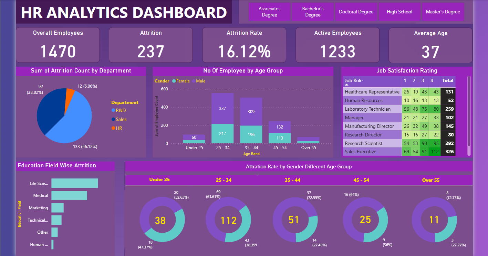

# 👥 HR Analytics Dashboard — Power BI

An interactive HR analytics dashboard built with Power BI to monitor employee attrition, workforce demographics, job satisfaction, and education-based trends — helping HR teams make data-driven decisions.

---

## 📸 Dashboard Preview



---

## 🎯 Project Overview

This dashboard provides a comprehensive view of HR metrics for a workforce of 1,470 employees. It enables HR managers and business leaders to identify attrition patterns, understand workforce demographics, and act on job satisfaction data across departments and age groups.

---

## 📈 Key Metrics at a Glance

| Metric | Value |
|---|---|
| Overall Employees | **1,470** |
| Total Attrition | **237** |
| Attrition Rate | **16.12%** |
| Active Employees | **1,233** |
| Average Age | **37 years** |

---

## ✨ Dashboard Features

- 🎓 **Education Filter** — Slice all metrics by education level (Associates, Bachelor's, Doctoral, High School, Master's)
- 🏢 **Attrition by Department** — Pie chart showing R&D (56.12%), Sales (38.82%), HR (5.06%) breakdown
- 👥 **Employees by Age Group** — Grouped bar chart by gender across 5 age bands (Under 25 to Over 55)
- ⭐ **Job Satisfaction Rating** — Matrix table showing satisfaction scores (1–4) by job role
- 📚 **Education Field Wise Attrition** — Horizontal bar chart across Life Sciences, Medical, Marketing, Technical, etc.
- 🍩 **Attrition Rate by Gender & Age Group** — Donut charts showing male/female attrition split across all age bands

---

## 🗂️ Data Fields Used

**Calculated Measures (Attrition Rate Table)**
- Active Employees, Attrition Rate, Attrition Count

**HR Dataset (Table1) — Key Fields**
- Demographics: Age, Gender, Marital Status, CF_age band
- Job Info: Department, Job Role, Job Level, Job Involvement, Business Travel, Over Time
- Satisfaction: Job Satisfaction, Environment Satisfaction, Work Life Balance, Relationship Satisfaction
- Compensation: Monthly Income, Daily Rate, Hourly Rate, Monthly Rate, Percent Salary Hike, Stock Option Level
- Experience: Years At Company, Years In Current Role, Years Since Last Promotion, Years With Current Manager, Total Working Years, Num Companies Worked
- Education: Education, Education Field
- Performance: Performance Rating, Training Times Last Year

---

## 🛠️ Tools & Technologies

| Tool | Purpose |
|---|---|
| Power BI Desktop | Dashboard design and interactivity |
| Power Query Editor | Data cleaning and transformation |
| DAX | Attrition rate, active employee count, CF measures |
| Data Modeling | Relationships between fact and calculated tables |

---

## 🔑 Key DAX Measures

```dax
-- Attrition Rate
Attrition Rate = 
DIVIDE(
    CALCULATE(COUNT(Table1[Attrition]), Table1[Attrition] = "Yes"),
    COUNT(Table1[Attrition]),
    0
) * 100

-- Active Employees
Active Employees = 
CALCULATE(COUNT(Table1[Attrition]), Table1[Attrition] = "No")

-- Attrition Count
Attrition Count = 
CALCULATE(COUNT(Table1[Attrition]), Table1[Attrition] = "Yes")

-- CF Age Band (Calculated Column)
CF_age band = 
SWITCH(
    TRUE(),
    Table1[Age] < 25, "Under 25",
    Table1[Age] < 35, "25 - 34",
    Table1[Age] < 45, "35 - 44",
    Table1[Age] < 55, "45 - 54",
    "Over 55"
)
```

---

## 💡 Key Insights

- 🔴 **R&D department** has the highest attrition count (133 employees — 56.12% of total attrition)
- 👶 **Age group 25–34** has the highest attrition at 112 employees, with 61.61% male
- 🎓 **Life Sciences** education field shows the highest attrition among all education backgrounds
- 💼 **Sales Executives** have the highest job satisfaction total (326) while **Research Directors** have the lowest (80)
- ⚖️ **Age group 35–44** shows the most balanced gender split in attrition (72.55% male vs 27.45% female)

---

## 📁 Repository Structure

```
hr-analytics-dashboard-powerbi/
│
├── HR_ANALYTICS_DASHBOARD.pbix     # Main Power BI report
├── assets/
│   └── Dashboard.png               # Dashboard screenshot
├── .gitignore
└── README.md
```

---

## 🚀 How to Open

1. Download [Power BI Desktop](https://powerbi.microsoft.com/desktop/) — free
2. Clone this repo:
   ```bash
   git clone https://github.com/Naaveen13/hr-analytics-dashboard-powerbi.git
   ```
3. Open `HR_ANALYTICS_DASHBOARD.pbix` in Power BI Desktop
4. Click **Refresh** and explore!

---

## 📬 Contact

**Naveen Krishna Venigandla**  
📧 naveenkrishna.v13@gmail.com  
🔗 [LinkedIn](https://www.linkedin.com/in/naveen-krishna-324b341bb)
